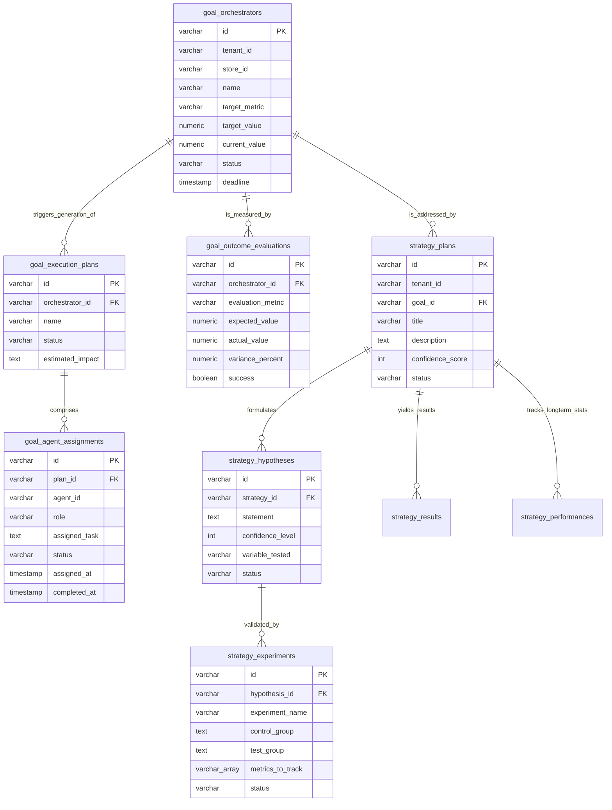

# AI Commerce OS - 实体关系模型 (认知决策与自愈核心 ERD)

本文档描述 **Enterprise Brain（总后台大脑）** 核心 **Phase 199 至 Phase 202** 认知层、自适应策略层与自愈经验仓储实体之间的物理与逻辑连接拓扑。

## 认知级联规则与闭环流控 (Cognitive Cascading Rules)
1. **战役强级联 (Campaign Cascading):**
   - 如果管理员强制清理终止某一核心经营目标 (`goal_orchestrators`)，其拆解派生出的中微观战役行动大纲 (`goal_execution_plans`) 以及多智能体任务指派书 (`goal_agent_assignments`) 将同步被 PostgreSQL **ON DELETE CASCADE** 精准清扫出列，保护运行空间原子性。
2. **策略软关联与保护 (Strategy Preservation):**
   - 当行动目标被结清或物理下架时，关联该目标的策略决策预案 (`strategy_plans`) 指向目标的外键会 **ON DELETE SET NULL** 软归还降级置空。
   - **理由**：经营目标可以是一次性的，但大脑研发的战略分析、博弈 A/B 对抗证据、降价对冲假设等对未来决策自愈极具常识沉淀性。我们必须让它脱离对单一战役存续的生理依赖，永久沉淀至 `outcome_memories` 与 `business_memories` 中作为终身资产复用调配！
