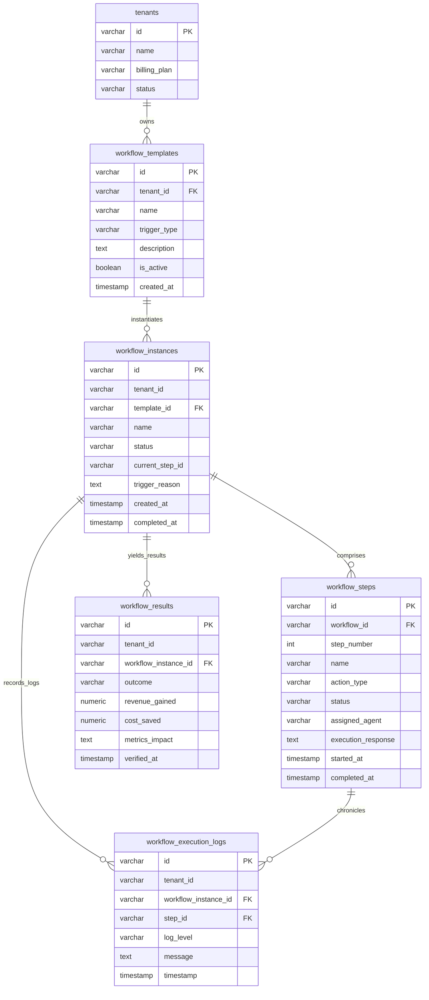

# AI Commerce OS - 实体关系模型 (ERD)

本文档描述 **Enterprise Brain（总后台大脑）** 核心多租户底座与 **Phase 195: Business Workflow Engine（自适应工作流引擎）** 实体之间的物理及逻辑关系。

## 平台关系与级联规则 (Cascade Rules)
1. **多租户安全防护边界 (SaaS Partitioning):**
   - 所有的主干表（包含模板、实例、审计记录、结算结果）均严格冗余设计有 `tenant_id`，保证快速索引过滤，绝不产生跨租户越权。
2. **严格的外键级联与容错 (Cascade & Integrity):**
   - `workflow_instances` (运行实例) 强关联在 `workflow_templates` (模板) 上。一旦模板被管理员注销强制物理删除，其关联的所有运行历史数据将被同步级联删除。
   - 类似的，如果删除某个 `workflow_instances`，它对应的所有执行步骤 (`workflow_steps`) 以及结算成就 (`workflow_results`) 均会自动进行 Cascade 清理，防止脏数据污染。
   - `workflow_execution_logs` (审计线索表) 对 `workflow_steps` 采用的是 `ON DELETE SET NULL` 的软降级规则，从而在清理步骤数据时，依然能够在日志中完整保留当时的操作回放全貌。
